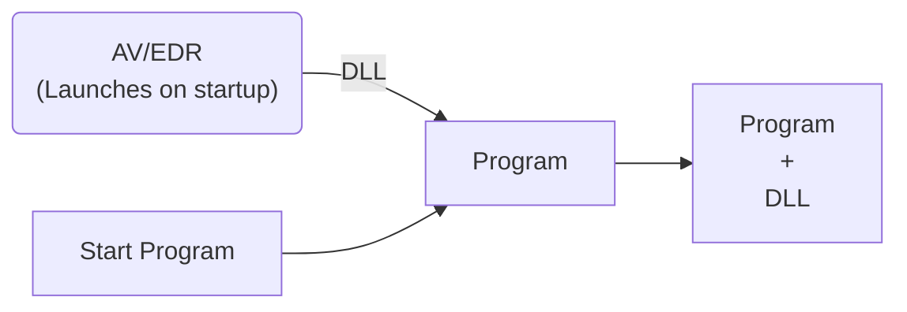
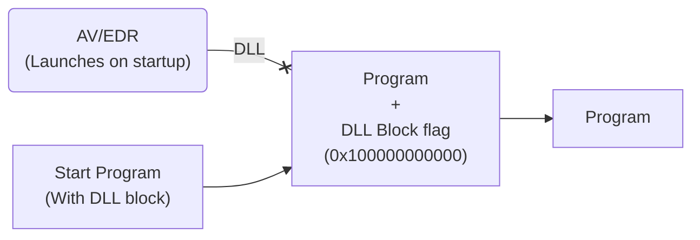

This article will serve as an entry point into a multi-part evasion technique series to bypass antivirus (AV) and endpoint detection and response (EDR) systems. This method can also help protect legitimate processes againt several different malware injection strategies used by modern day state of the art malicious software.

---

<details>
  <summary><strong>Table of Contents</strong></summary>
<div markdown="1">

- [Introduction](#introduction)
- [Overview](#overview)
- [Understanding API Hooking and DLL Injection](#understanding-api-hooking-and-dll-injection)
- [Implementation](#implementation)
    - [Handling Command Line Arguments](#1-handling-command-line-arguments)
    - [Converting the Target Program Path](#2-converting-the-target-program-path)
    - [Initializing Process Creation Attributes](#3-initializing-process-creation-attributes)
    - [Configuring Process Mitigation Policy](#4-configuring-process-mitigation-policy)
    - [Creating the Target Process](#5-creating-the-target-process)
    - [Cleanup and Resource Deallocation](#6-cleanup-and-resource-deallocation)
    - [Profit???](#7-profit)
- [Conclusion](#conclusion)

</div>
</details>

## Introduction

Many antivirus (AV) and endpoint detection and response (EDR) solutions heavily rely on user-mode API hooking to detect malicious behavior in real-time. By injecting a dynamic-link library (DLL) into user processes, these products can monitor and identify suspicious activities during runtime.



In this article, we will explore the technique of blocking these hooking processes outright to bypass AVs/EDRs (also can be used to block malware from hooking onto, and hiding itself inside of legitimate programs as well). For our demonstration we will use a simulated AV/EDR DLL that will print out a simple "hello world" message on the `DLL_PROCESS_ATTACH` event, implemented in a DLL called **AV/EDR Simulated DLL** created using Visual Studio. We will simulate AV/EDR hooking by injecting this DLL, using a DLL injector called **DLL Injector**, into an example program called **dummy_program.exe**. Without further adieux lets get started!

> You do not have to know or understand how to create a DLL or DLL Injector to follow along with this article or how the `DLL_PROCESS_ATTACH` event works. However, if you are interested in learning more about these topics, I recommend checking out the following articles: (im still working on them lol)
{: .prompt-warning }

> All of the source code for this article, including the mock DLL, injector, and dummy program are available on [GitHub](https://github.com/9xN/Patching-DLL-Entry-Points)
{: .prompt-info }

## Overview

Our DLL Blocker program will outright *prevent* the loading of non-Microsoft signed DLLs into a target process. By leveraging the Windows API, a little bit of C knowledge, and process creation mitigation policies, we can fortify our system against *most* DLL injection occuring in a target process.



## Understanding API Hooking and DLL Injection

> I will be providing a much more in-depth guide and information regarding process injection in its entirety in [this](https://44.is-a.dev/categories/malware/process-injection/) section in my site.
{: .prompt-info }

User-mode API hooking involves injecting a DLL into targeted processes to intercept and monitor system calls and events. This technique allows AV/EDR solutions to intercept and analyze the behavior of running processes. By examining the DLLs loaded into processes, we can gain insights into the hooking mechanism employed by AV/EDR solutions. To illustrate this, we will utilize Sysinternals' Process Explorer, a powerful tool for inspecting running processes and their associated DLLs. The expected output of this tool is that we should be able to see our **AV/EDR Simulated DLL** loaded into the **dummy_program.exe** process. This DLL is responsible for simulated hooking functionality.


_Injector program injecting external DLL into **dummy_program.exe**_


_**dummy_program.exe** That has been comprimised/hooked by **AV/EDR Simulated DLL**_


_Process explorer showing loaded DLL inside **dummy_program.exe**_

## Implementation

Ok, so now that we have some background information about how AV/EDR hooking works, lets get started with our DLL Blocker program. We will start off by opening up Visual Studio and creating a new blank template project. I decided to name mine **DLL Blocker** but you can really put just about anything your heart desires. For this example I decided to use **C** programming language as I am fairly well versed and familiar with it but you can use any programming language you want as long as there is some sort of implementation that allows you to utilize the Windows API.
Alright, now that we have a blank project open, lets get started with the code.

> For the sake of simplicity I will only be importing the windows.h header file and stdio.h for some basic information logging and error printouts. However, if you are planning on using this code in a larger project or in conjuction with other code or evasion techniques I will be covering later on, you may need to import other header files as well.
{: .prompt-info }

### 1. Handling Command Line Arguments:

In this initial step, we handle the command line arguments passed to the program. The command line argument we require is the path of the target program we want to protect. If no argument is provided, we display the correct usage of the program and then exit with a returned error code of 1.

```c
if (argc < 2)
{
    printf("Usage: %s <target_program_path>\n", argv[0]);
    return 1;
}
```

### 2. Converting the Target Program Path:

Since the Windows API functions that we will use require wide-character strings, we need to convert the narrow-character string representing the target program path to a wide-character string. This conversion ensures compatibility with the Windows API functions.

```c
const char* targetPath = argv[1];
int wideCharLen = MultiByteToWideChar(CP_UTF8, 0, targetPath, -1, NULL, 0);
wchar_t* wideCharBuffer = new wchar_t[wideCharLen];
MultiByteToWideChar(CP_UTF8, 0, targetPath, -1, wideCharBuffer, wideCharLen);
```

### 3. Initializing Process Creation Attributes:

To provide extended information during process creation, we initialize the `STARTUPINFOEXA` structure. This structure allows us to specify additional attributes for the new process, such as process mitigation policies (hint hint).

```c
STARTUPINFOEXA si = {};
PROCESS_INFORMATION pi = {};
SIZE_T size = 0;

si.StartupInfo.cb = sizeof(STARTUPINFOEXA);
si.StartupInfo.dwFlags = EXTENDED_STARTUPINFO_PRESENT;
```

### 4. Configuring Process Mitigation Policy:

Now here is where the magic happens.
We enable the blocking of *non-Microsoft signed DLLs* by setting the `PROCESS_CREATION_MITIGATION_POLICY_BLOCK_NON_MICROSOFT_BINARIES_ALWAYS_ON` policy (resolves to a value of 0x100000000000). This step ensures that only trusted DLLs are allowed to be loaded into the target process.

```c
DWORD64 policy = PROCESS_CREATION_MITIGATION_POLICY_BLOCK_NON_MICROSOFT_BINARIES_ALWAYS_ON;

UpdateProcThreadAttribute(si.lpAttributeList, 0, PROC_THREAD_ATTRIBUTE_MITIGATION_POLICY, &policy, sizeof(policy), NULL, NULL);
```

### 5. Creating the Target Process:

We use the `CreateProcessW` function to create the target process (specified in our argument to the path of the program we would like to run), passing the converted wide-character path and the initialized attributes. If the process creation fails, we handle the error and display an appropriate error message, again returning a error code of 1.

```c
if (!CreateProcessW(
    NULL,
    wideCharBuffer,
    NULL,
    NULL,
    true,
    EXTENDED_STARTUPINFO_PRESENT,
    NULL,
    NULL,
    reinterpret_cast<LPSTARTUPINFOW>(&si),
    &pi
))
{
    fprintf(stderr

, "Failed to create the target process.\n");
    // Cleanup and resource deallocation
    // ...
    return 1;
}
```

### 6. Cleanup and Resource Deallocation:

After the process creation, we close the process handles and deallocate the dynamically allocated resources to prevent memory leaks. This step ensures that system resources are properly released (yes I know this is a super small and simple program and this hardly has any effect on preformance or usability but we are supposed to be good programmers and this is the correct coding etiquette).

```c
CloseHandle(pi.hThread);
CloseHandle(pi.hProcess);
// Free buffers
free(wideCharBuffer);
HeapFree(GetProcessHeap(), 0, si.lpAttributeList);
```

### 7. Profit???

Wow it feels like just 5 minutes ago we were nothing but meer skids copy and pasting 20 year old code from StackOverflow without a care in the world and now look at us, we are fully fledged programmers with an 31337 AV/EDR bypass program that is ready to be compiled and executed and ran in the wild (with consent of course ;). Now that we have finished our program, lets compile it and see what happens when we try to inject a external unsigned DLL into a poor defenceless ordinary program.


_Running **dummy_program.exe** with **DLL Blocker**_


_Process explorer output before injection_


_Injecting **AV/EDR Simulated DLL**_

Now hopefully if everything decided to behave itself we *should* see no changes to our **dummy_program.exe** or in the loaded DLLs monitored within process explorer.


_Error popup indicating the DLL failed to inject/load into **dummy_program.exe**_


_**dummy_program.exe** still running with **DLL Blocker** and no change to output_

and finally...


_Process explorer output showing that no other DLLs have loaded into **dummy_program.exe**_

Success!

## Conclusion:

In this article, we explored the process of building a DLL Blocker program using C and the Windows API. By implementing process creation mitigation policies, we can effectively protect a program from potential DLL injection attacks and/or from AV/EDR hooking. However, it's important to understand the limitations of this approach. The policy we enabled in the program is effective in preventing the loading of non-Microsoft signed DLLs. However, it should be noted that it primarily applies to child processes created by the program. This means that if the program itself is already running and has loaded unauthorized DLLs, the policy may not have an immediate impact.

> Furthermore, the effectiveness of the policy can be impacted if the AV/EDR is cross-signed by Microsoft.
{: .prompt-warning }

The program demonstrates just *one* possible way to help improve your projects evasion level in a secure enviroment and as I mentioned before just only just the beginning. In my next project I will be exploring a more *advanced* technique known as DLL patching and how we can also use this technique to bypass AV/EDR hooks and evade detection in a much *quieter* and *effective* way. I hope you enjoyed this article and I will see you in the next one!