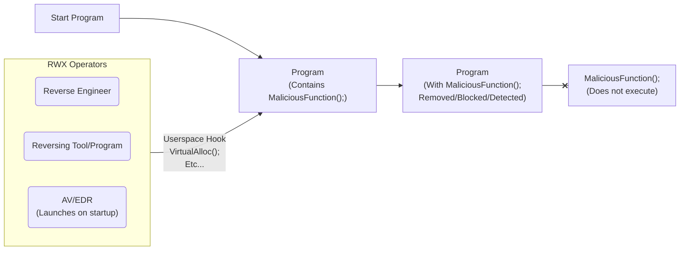
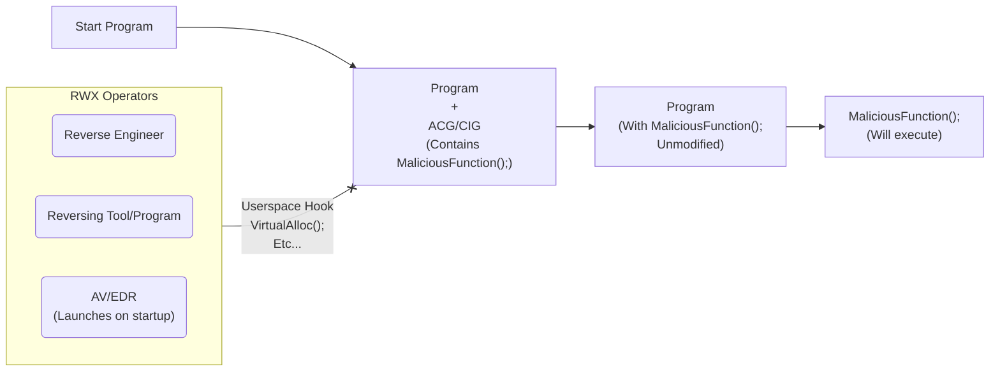

This article is a continuation in a multi-part evasion technique series to bypass antivirus (AV) and endpoint detection and response (EDR) systems. This method, unlike the last one discussed [here](https://44.is-a.dev/posts/Building-A-DLL-Blocker/), imposes a different strategy that can also help protect against reverse engineering efforts made by blue team analysts. Similarly to other methods discussed in this series, this concept can also apply to aid in protecting legitimate processes againt several different code execution strategies used by modern day state of the art malicious software.

---

<details>
  <summary><strong>Table of Contents</strong></summary>
<div markdown="1">

- [Introduction](#introduction)
- [Overview](#overview)
- [A foreword on Code Integrity Guard (CIG)](#a-foreword-on-code-integrity-guard-cig)
- [RWX Operations](#rwx-operations)
- [Downsides of ACG](#downsides-of-acg)
- [But what about JIT compiled code?](#but-what-about-jit-compiled-code)
- [Mitigating these downsides](#mitigating-these-downsides)
- [Implementation](#implementation)
    - [1. Laying out the groundwork:](#1-laying-out-the-groundwork)
    - [2. Program entry point:](#2-program-entry-point)
    - [3. Configuring Process Mitigation Policy:](#3-configuring-process-mitigation-policy)
    - [4. Running the first RWX test (pre-mitigation policy):](#4-running-the-first-rwx-test-pre-mitigation-policy)
    - [5. Applying the mitigation policy:](#5-applying-the-mitigation-policy)
    - [6. Running the second RWX test (post-mitigation policy):](#6-running-the-second-rwx-test-post-mitigation-policy)
    - [7. Finishing the program and final thoughts:](#7-finishing-the-program-and-final-thoughts)
- [Conclusion](#conclusion)

</div>
</details>

## Introduction

The widespread use of DLL loading/injection in programs, including instances where these DLLs are signed by reputable entities like Microsoft, (the weakness of our [last approach](https://44.is-a.dev/posts/Building-A-DLL-Blocker/)) highlights the need for more robust and adaptable mitigation strategies. This is particularly important in the context of malware development, where such strategies can serve as potent countermeasures against detection of our meticulously crafted payloads and or target processes. By combining this technique with our [previous approach](https://44.is-a.dev/posts/Building-A-DLL-Blocker/), we can effectively protect against a myriad of threat actors rather than just one.



In this article, we will explore the technique of using Arbitrary Code Guard (ACG) and breifly touch on Code Integrity Guard (CIG) to block operations on executable memory pages to bypass AVs/EDRs, as well as, some reverse engineering methods and advanced debugger programs (also can be used to prevent malware from hooking onto, and nesting itself inside of legitimate programs as well). Pretty much, our program can effectively prevent the execution of dynamically generated code. By doing so, we not only secure the front door but also the windows, the back door, and even the chimney, making life as difficult as possible for any possible threat actors.
For our demonstration we will be,
1. Attempting to allocate new memory with executable permissions, and
2. Attempting to make existing memory with executable permissions writable.
In order to accomplish these tasks we will use the `VirtualAlloc()`, as well as, `VirtualProtect()` functions from the Windows API to simulate a read-write-execute (RWX) operation from an AV/EDR in an example program called **acg_program.exe**. Without wasting anymore time lets get started!

> I originally intended to include CIG as one of the main methods discussed in this article but upon further research, the use cases for *very* specific threat actors is particularly refined not to mention this can be a very *noisy* solution. There is also the chance that it might break your system as it is not compatible with certain hardware and messes around with Windows Registry settings while using virtualization and sandboxing. However, if you are interested in learning more about these topics, I recommend checking out the following articles: 
- [Microsoft Documentation information on what CIG does and can be used for](https://learn.microsoft.com/en-us/windows/security/application-security/application-control/introduction-to-device-guard-virtualization-based-security-and-windows-defender-application-control)
- [Microsoft Documentation for enabling such protection](https://learn.microsoft.com/en-us/windows/security/hardware-security/enable-virtualization-based-protection-of-code-integrity)
{: .prompt-warning }

> All of the source code for this article is available on [GitHub](https://github.com/9xN/Blocking-Operations-On-Executable-Memory-Pages)
{: .prompt-info }

## Overview

One such technique commonly employed by AV/EDR products is the implementation of userspace hooks around critical functions. However, these hooks often rely on the ability to modify existing executable pages, necessitating the use of functions such as the aforementioned `VirtualProtect()` to update memory protection. More so, a malicious, or more intrusive threat actor might even try to allocate memory with `VirtualAlloc()` to then use later on to run arbitrary code. By blocking operations on executable memory pages and restricting the creation of RWX pages, we can potentially render even a Microsoft-signed DLL ineffective. 



## A foreword on Code Integrity Guard (CIG)

As mentioned in the introduction, I was originally going to include CIG in conjuction with ACG but its *just not stable enough* and *not worth the risk* of breaking the target system in an attempt to pull this off. *Not to mention* could have adverse effects on our payload itself and or target process preformance. However, I will still briefly touch on the topic and have provided some resources for further reading if you are interested in learning more about it up above.

> Memory integrity is sometimes referred to as hypervisor-protected code integrity (HVCI) or hypervisor enforced code integrity, and was originally released as part of Device Guard. Device Guard is no longer used except to locate memory integrity and VBS settings in Group Policy or the Windows registry.
{: .prompt-info }

CIG is a feature that is part of Windows Defender Application Control (WDAC) that uses virtualization-based security to prevent unsigned code from being loaded into the kernel. This is accomplished by using a hypervisor to create a virtualized environment for the kernel to run in. This virtualized environment is known as the hypervisor-enforced code integrity (HVCI) environment. 

The HVCI environment is isolated from the rest of the system and is protected from any unsigned code that may be running on the system. This means that any unsigned code that attempts to run in the kernel will be blocked by the hypervisor. 

This is a very powerful feature that can be used to prevent malicious code from running in the kernel. However, it is not without its drawbacks. For example, CIG is not compatible with all hardware and can cause system instability. Furthermore, it is not compatible with all versions of Windows 10, however it does seem to *mostly sorta work* on Windows 11.


_Diagram of the HVCI compartmentalization_

## RWX Operations

In our example program we will use `VirtualAlloc()` and `VirtualProtect()`, however, there are several other Windows API functions you could use instead of these two in the code example:

- VirtualAllocEx

This allocates memory in another process. You can specify executable permissions:

```c
void* mem = VirtualAllocEx(hProcess, NULL, 1024, MEM_COMMIT, PAGE_EXECUTE_READWRITE);
```

- NtAllocateVirtualMemory

Lower level API to allocate memory with RWX permissions:

```c
void* mem;
NtAllocateVirtualMemory(GetCurrentProcess(), &mem, 0, 1024, 
  MEM_COMMIT | MEM_RESERVE, PAGE_EXECUTE_READWRITE);
```

- VirtualProtectEx

Changes permissions on an existing memory region in another process:

```c 
VirtualProtectEx(hProcess, lpAddress, dwSize, flNewProtect, &lpflOldProtect);
```

- NtProtectVirtualMemory

Lower level API to modify protections on a memory region:

```c
HANDLE hProcess;
void* baseAddress;

NtProtectVirtualMemory(hProcess, &baseAddress, &size, 
  newProtection, &oldProtection);
```

- ZwProtectVirtualMemory

Kernel-mode version of NtProtectVirtualMemory:

```c
ZwProtectVirtualMemory(hProcess, &baseAddress, &size,
  newProtection, &oldProtection);
```

So in summary, the key Windows API options for modifying page protections are VirtualProtect, VirtualAllocEx, and the Nt/Zw variants.

> Note: these are just a few of the possible RWX operations that can be used to modify memory protections. There are many more that can be used to accomplish the same task all the way from the high level Windows API, as well as, the lower level Nt/Zw API and its abstractions.
{: .prompt-warning }

## Downsides of ACG

While Arbitrary Code Guard (ACG) provides strong mitigation against exploits, some may assume it completely prevents injecting arbitrary code into a protected process. This is a common misconception. Now you may be asking yourself, how can this be? How can we still inject arbitrary code into a protected process if ACG prevents making memory executable? Well smart reader, you raise a good point - if ACG prevents making memory executable, how can we still inject arbitrary code into a protected process?

The key is that ACG only prevents a process from making its own memory executable. It does not restrict a remote process from allocating executable memory in the target process.

Specifically, ACG allows calls like `VirtualAllocEx()` from remote processes to allocate memory with executable permissions in the target process. This allows injecting shellcode into the allocated memory region.

Once allocated, the target process can execute this shellcode, even though ACG prevents it from marking its own memory executable.

So in summary:

- ACG prevents a process from making its own memory executable after-the-fact. Calls like VirtualProtect() will fail.

- But ACG does not restrict other processes from allocating executable memory in the target process. 

- This allows injecting arbitrary shellcode into the freshly allocated RWX memory.

- The target process can then execute the injected shellcode, bypassing ACG's protections on its own memory.

So ACG makes exploitation harder by preventing common techniques like marking stack/heap memory as executable. But it does not prevent the initial allocation of executable memory for shellcode injection.

The tradeoff is allowing processes to allocate executable memory is required for legitimate functionality like just-in-time (JIT) compilers to work. ACG tries to strike a balance in increasing exploit difficulty while permitting necessary executable allocations.

## But what about JIT compiled code?

JIT engines need to generate executable code at runtime, which seems incompatible with ACG. Microsoft Edge handles this cleverly with a separate JIT process. The browser content runs in a protected process with ACG enabled. The JIT engine runs in a separate unprotected process called `MicrosoftEdgeCP.exe`. The JIT process allocates memory pages as read-write to allow generating code. These pages are mapped into the content process as read-execute, allowing the content process to run the JIT code while staying protected by ACG. So in summary, ACG forces attackers to rely on complex ROP techniques for their full shellcode. The separate JIT process pattern allows JIT compiled code while keeping ACG protection intact. These measures significantly raise the bar for exploit reliability and complexity.

## Mitigating these downsides

Exploit mitigation techniques like ACG aim to prevent attackers from easily executing arbitrary code during an exploitation attempt.

A common exploit technique is to inject malicious shellcode into the target process's memory space. The attacker needs this memory to be writable so they can inject the code. However, they also need it to be executable to actually run the shellcode. 

This is where DEP (Data Execution Prevention) comes in - it prevents code execution from memory regions marked as only writable. So attackers got around this using return-oriented programming (ROP) - chaining together snippets of existing executable code to build their payload. ROP is complex and tedious though. 

An easier method is to change the permissions on the shellcode's memory page to make it executable after injecting it. The attacker can use API functions like `VirtualProtect()` to mark the page as executable. ACG blocks these attempts to change permissions. Any call to `VirtualProtect()` or similar to mark pages as executable will fail. Now the attacker has no choice but to fully ROP their exploit payload.

## Implementation

Ok, so now that we have some background information about how and what RWX is, as well as, a general understanding of ACG, lets get started with our RWX blocker program. We will start off by opening up Visual Studio and creating a new blank template project. I decided to name mine **ACG Program** but you can really put just about anything your heart desires. For this example I decided to use **C** programming language as I am fairly well versed and familiar with it but you can use any programming language you want as long as there is some sort of implementation that allows you to utilize the Windows API.

Alright, now that we have a blank project open, lets get started with the code.

> For the sake of simplicity I will only be importing the windows.h header file and stdio.h for some basic information logging and error printouts. However, if you are planning on using this code in a larger project or in conjuction with other code or evasion techniques I will be covering later on, you may need to import other header files as well.
{: .prompt-info }

### 1. Laying out the groundwork:

In this initial step, we declare a pointer to a function and initialize it with the memory address returned by the `malloc()` function. This is just a dummy function that will be used later to demonstrate the `VirtualProtect()` function.

```c
// Dummy function pointer to use for VirtualProtect demo
void* dummyFunction = (void*)malloc;
```

This next function tries to allocate some RWX memory using the `VirtualAlloc()` function with the `MEM_RESERVE | MEM_COMMIT` flags set, which reserve and commit the specified memory region. The `PAGE_EXECUTE_READWRITE` flag is also set to allow the memory to be both readable and writable as well as executable.

If the allocation is successful, the memory address is printed to the console. The function then tries to update an existing memory page with RWX protection using the `VirtualProtect()` function. The `dummyFunction` pointer is used as the memory address to update, and the `4096` parameter specifies the size of the memory page being updated. If the protection update is successful, the memory address of the function is printed to the console.


```c
void rwxOperations() {
    DWORD oldProtection;

    // Let's try to allocate some RWX memory
    void* mem = VirtualAlloc(0, 1024, MEM_RESERVE | MEM_COMMIT, PAGE_EXECUTE_READWRITE);
    if (mem == NULL) {
        printf(" |--- [-] Error allocating RWX memory\n");
    }
    else {
        printf(" |--- [+] RWX memory allocated: %p\n", mem);
    }

    // Let's also try a VirtualProtect to see if we can update an existing page to RWX
    if (!VirtualProtect(dummyFunction, 4096, PAGE_EXECUTE_READWRITE, &oldProtection)) {
        printf(" |--- [-] Error updating dummyFunction [%p] memory to RWX\n\n", dummyFunction);
    }
    else {
        printf(" |--- [+] dummyFunction [%p] memory updated to RWX\n\n", dummyFunction);
    }
}
```

### 2. Program entry point:

We start off the entry point of the program by specifying;

```c
int main(void) {
    // ...
}   
```
This step defines the `main()` function the void keyword in the parentheses indicates that the function takes no arguments. 

> It is important to note that specifying void inside of the main paranthese is a debate that has been going on for a while now and is not required depending on your compiler or C version. However, it is still a good practice to include it as it makes the code more readable and easier to understand. You can read more about this in [this](https://stackoverflow.com/questions/3156423/why-dont-we-use-void-in-main) StackOverflow post.
{: .prompt-info }

We also go ahead and declare a variable `c` to hold the value returned by the `getchar()` function. This is used to pause the program execution and wait for the user to make an input on their keyboard before continuing in order to help us demonstrate the process using process hacker.

```c
int c;
```

### 3. Configuring Process Mitigation Policy:

First off we declare a `PROCESS_MITIGATION_DYNAMIC_CODE_POLICY` structure named `policy`.

Here is what the structure internals look like in the Windows API:

```c
typedef struct _PROCESS_MITIGATION_DYNAMIC_CODE_POLICY {
  union {
    DWORD Flags;
    struct {
      DWORD ProhibitDynamicCode : 1;
      DWORD AllowThreadOptOut : 1;
      DWORD AllowRemoteDowngrade : 1;
      DWORD AuditProhibitDynamicCode : 1;
      DWORD ReservedFlags : 28;
    } DUMMYSTRUCTNAME;
  } DUMMYUNIONNAME;
} PROCESS_MITIGATION_DYNAMIC_CODE_POLICY, *PPROCESS_MITIGATION_DYNAMIC_CODE_POLICY;
```

And here is what it looks like when we define the policy variable in our program:

```c
PROCESS_MITIGATION_DYNAMIC_CODE_POLICY policy;
```

We then use the `ZeroMemory()` function to zero out the memory allocated for the `policy` structure. This is necessary because the `SetProcessMitigationPolicy()` function requires the structure to be initialized to 0.

```c
ZeroMemory(&policy, sizeof(policy));
```

After this we set the `policy.ProhibitDynamicCode` field to 1 to indicate that dynamic code creation should be prohibited and print out a message to the console indicating that the program has started.

```c
policy.ProhibitDynamicCode = 1;

printf("Program started\n---------------\n");
```

### 4. Running the first RWX test (pre-mitigation policy):

At this point in the program we now want to test out those two RWX functions we were talking about before. We start off by printing a message to the console and wait for the user to press a key before calling the `rwxOperations()` function to allocate and set RWX memory.

```c
printf("[*] Press a key to allocate and set RWX memory...\n");
c = getchar();
rwxOperations();
```

The output we get should look something like this:


_Terminal Output of the **first** RWX Test_

### 5. Applying the mitigation policy:

Ok so now we have made it to the part in the article where the actual magic happens, first off, we print a message to the console and wait for the user to make an input with their keyboard before calling the `SetProcessMitigationPolicy()` function to apply the `PROCESS_MITIGATION_DYNAMIC_CODE_POLICY` mitigation policy.

Before we do this however, there is a very easy way to actually check if our policy is applied via an external process managing program called process hacker. Using process hacker. In this image below we can see that the `acg_program.exe` process has the "DEP" and "ASLR" policies applied that we touched on briefly [here](#mitigating-these-downsides) but does **not** have any mitigation policies against dynamic code execution.


_ACG Program running with **no** dynamic code prohibited policy_

Now back to the code:

```c
printf("[*] Press a key to run SetProcessMitigationPolicy to apply PROCESS_MITIGATION_DYNAMIC_CODE_POLICY...\n");
c = getchar();
```

Once the user has made an input we can use the `SetProcessMitigationPolicy()` function to apply the `PROCESS_MITIGATION_DYNAMIC_CODE_POLICY` mitigation policy. If the function call fails, an error message is printed to the console and the program returns 1 to indicate failure. If the function call is successful, a message is printed to the console indicating that the policy has been set.

```c
if (SetProcessMitigationPolicy(ProcessDynamicCodePolicy, &policy, sizeof(policy)) == false) {
    printf(" |--- [-] SetProcessMitigationPolicy failed\n");
    return 1; // Return 1 on failure
}
else {
    printf(" |--- [+] Process mitigation policy set\n\n");
}
```

The terminal output should look something like this now:


_Terminal Output Once we Attempt to Apply the Policy_

Now if we go back to process hacker and refresh the process list we can see that the `acg_program.exe` process still has the same "DEP" and "ASLR" policies applied, however, it now also has the `PROCESS_MITIGATION_DYNAMIC_CODE_POLICY` mitigation policy applied to it.


_ACG Program running **with** dynamic code prohibited policy_

### 6. Running the second RWX test (post-mitigation policy):

Now that the policy has been set can print a message to the console and wait for the user to press a key before calling the `rwxOperations()` function again to try and allocate and set RWX memory again. However, this time the operation should fail due to the dynamic code policy being in effect.

```c
printf("[*] Press a key to allocate and set RWX memory again (should fail due to the dynamic code policy)...\n");
c = getchar();

// Allocate and set RWX memory again (should fail due to the dynamic code policy)
rwxOperations();
```

The output that we should be getting now should look something like this:


_Terminal Output of the **Second** RWX Test_

### 7. Finishing the program and final thoughts:

Finally, we can return 0 to indicate success and gracefully exit the program.

```c
return 0; // Return 0 on success
```

Now that we have finished our program, lets compile it and see what happens when we try to run it.


_Recording of Full Program Usage_

## Conclusion:

In this article, we built a program that demonstrates how to allocate and set RWX memory in Windows using the `VirtualAlloc()` function and how to apply the `PROCESS_MITIGATION_DYNAMIC_CODE_POLICY` mitigation policy to prohibit the creation of dynamic code. The `dummyFunction` pointer and the `VirtualProtect()` function are used to demonstrate updating the protection of an existing memory page to RWX.
We learnt about what exactly ACG really is, how it works, its downfalls, and how we can use it to our advantage to protect our programs from malicious threat actors.
This example program demonstrates just *one* possible way to help improve your projects evasion level in a secure enviroment and how to implement process creation mitigation policies. However we also discoverd that we can effectively protect a program from more threat actors by conjoining multiple of these policies together.
As I mentioned multiple times before this is only the beginning. In my next project I will be exploring a more *advanced* technique known as DLL patching and how we can also use this technique to bypass AV/EDR hooks and evade detection in a much *quieter* and *effective* way. I hope you enjoyed this article and I will see you in the next one!